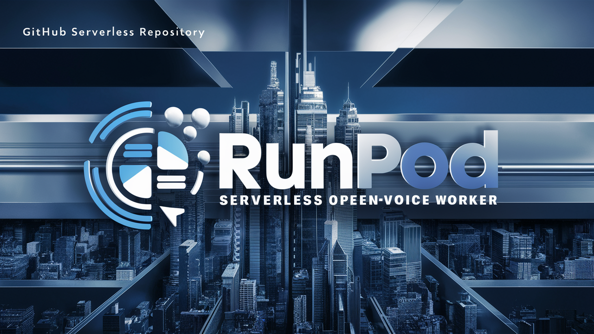

<<<<<<< HEAD
# RunPod Serverless OpenVoice Worker



This project allows users to install OpenVoice, an AI speech model that can clone voices, on RunPod serverless platform.

## Docker image

Docker image available at: [Docker Hub](https://hub.docker.com/repository/docker/drvpn/runpod_serverless_openvoice_worker)

=======
# RunPod Serverless GFPGAN FaceMan Worker


This project allows users to install FaceMan, a GFPGAN AI face enhancement model that enhances faces in video, on RunPod serverless platform.

## Docker image

Docker image available at: [Docker Hub](https://hub.docker.com/repository/docker/drvpn/runpod_serverless_faceman_worker)
>>>>>>> eb22df3 (Initial commit)

## Environment Variables

To run this application on RunPod serverless, you need to set the following environment variables:

- `BUCKET_ENDPOINT_URL`: The endpoint URL of your S3-compatible storage.
- `BUCKET_ACCESS_KEY_ID`: The access key ID for your S3-compatible storage.
- `BUCKET_SECRET_ACCESS_KEY`: The secret access key for your S3-compatible storage.

<<<<<<< HEAD
These variables are required to store and host the generated WAV files.
=======
These variables are required to store and host the enhanced MP4 video files.
>>>>>>> eb22df3 (Initial commit)

## Running on RunPod Serverless

### 1. `Clone the Repository`

```sh
<<<<<<< HEAD
git clone https://github.com/drvpn/runpod_serverless_openvoice_worker.git
cd runpod_serverless_openvoice_worker
=======
git clone https://github.com/drvpn/runpod_serverless_faceman_worker.git
cd runpod_serverless_faceman_worker
>>>>>>> eb22df3 (Initial commit)
```

2. `Build and Push Docker Image`
   - Follow RunPod's documentation to build and push your Docker image to a container registry.

3. `Deploy on RunPod`
   - Go to RunPod's dashboard and create a new serverless function.
   - Use the Docker image you pushed to your container registry.
   - Set the environment variables: `BUCKET_ENDPOINT_URL`, `BUCKET_ACCESS_KEY_ID`, `BUCKET_SECRET_ACCESS_KEY`.

4. `Invoke the Function`

<<<<<<< HEAD
You can invoke the function with a JSON payload specifying the text, language, and voice URL. Here is an example:

```sh
{
    "input": {
        "text": "Hello, world!",
        "voice_url": "https://example.com/path/to/voice.mp3",
        "language": "EN-NEWEST",
        "speed": 1.0
    }
}
```

Use RunPod's interface or an HTTP client to send this payload to the deployed function.

# Input
- `text`: The text the AI will transcribe
- `voice_url`: A URL to a wav file. This file should contain spoken words recorded in a quite environment.  This will become the voice of the speaker.
- `language`: The language the speaker will use when transcribing your text. Choose on of the following ['`EN`', '`EN-AU`', '`EN-BR`', '`EN-INDIA`', '`EN-US`', '`EN-DEFAULT`', '`EN-NEWEST`', '`ES`', '`FR`', '`ZH`', '`JP`', '`KR`']
- `speed`: Speed is the pace the speaker will use when speaking.

# Default values

- `text`: required `no default`
- `voice_url`: required `no default`
- `language`: default value is `EN-NEWEST`
- `speed`: default value is `1.0`

To override default values, you can set the following (optional) environment variables:

- `DEFAULT_TEXT`: sets new default for text
- `DEFAULT_LANGUAGE`: sets new default for language
- `DEFAULT_VOICE_URL`: Sets new default for voice_url 
- `DEFAULT_SPEED`: Sets new default for speed
=======
You can invoke the function with a JSON payload specifying the input video URL. Here is an example:

```sh
{
  "input": {
    "input_video_url": "https://www.example.com/myInputVideo.mp4"
  }
}
```

Use RunPod's interface or an HTTPS client (i.e. Postman) to send this payload to the deployed function.

# Input
- `video_url`: The video you want to enhance (required)
>>>>>>> eb22df3 (Initial commit)

## Example return value
```sh
{
  "delayTime": 789,
  "executionTime": 16608,
  "id": "your-unique-id-will-be-here",
  "output": {
<<<<<<< HEAD
    "output_audio_url": "https://mybucket.nyc3.digitaloceanspaces.com/OpenVoice/OpenVoice_20240613_213640_i7bzrf_32f210.wav"
=======
    "output_video_url": "https://apimedia.nyc3.digitaloceanspaces.com/Enhanced_GFPGAN/enhanced_2024_06_14_13.14.11.mp4"
>>>>>>> eb22df3 (Initial commit)
  },
  "status": "COMPLETED"
}
```

# Handler Explanation

The `handler.py` script orchestrates the following tasks:

- Maps a network volume to store checkpoints (if available).
- Downloads and caches model checkpoints if not already present.
<<<<<<< HEAD
- Converts text to speech with the supplied (cloned) voice.
- Uploads the generated audio file to S3-compatible storage and returns the public URL.
=======
- Enhances faces on each video frame and uses them to generate the enhanced video file
- Uploads the generated video file to S3-compatible storage and returns the public URL.
>>>>>>> eb22df3 (Initial commit)

## Contributing

Contributions are welcome! Please open an issue or submit a pull request.

## License

This project is licensed under the MIT License.
<<<<<<< HEAD
=======

>>>>>>> eb22df3 (Initial commit)
